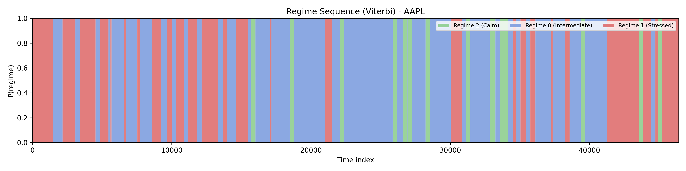
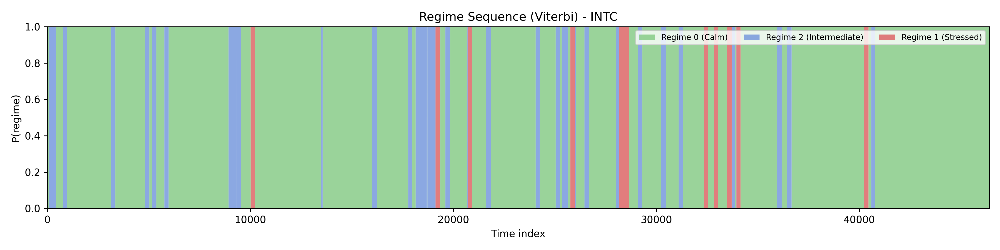
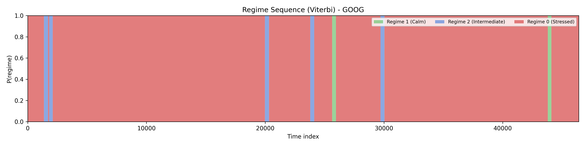
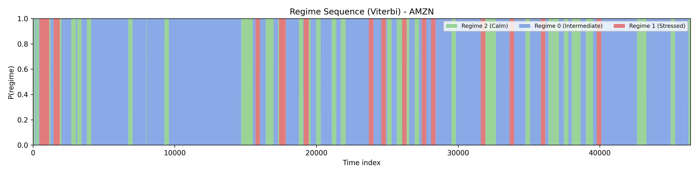
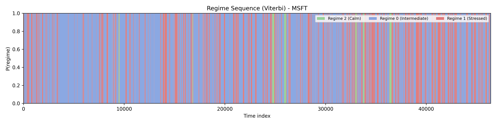
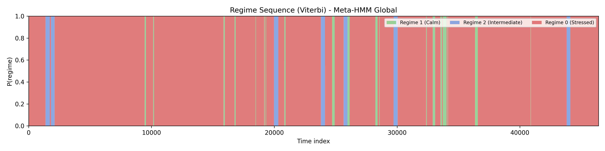
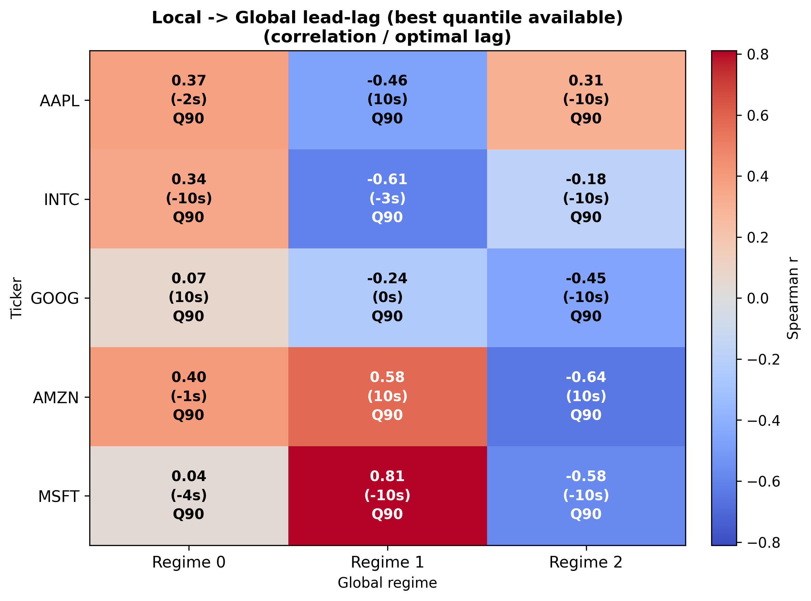
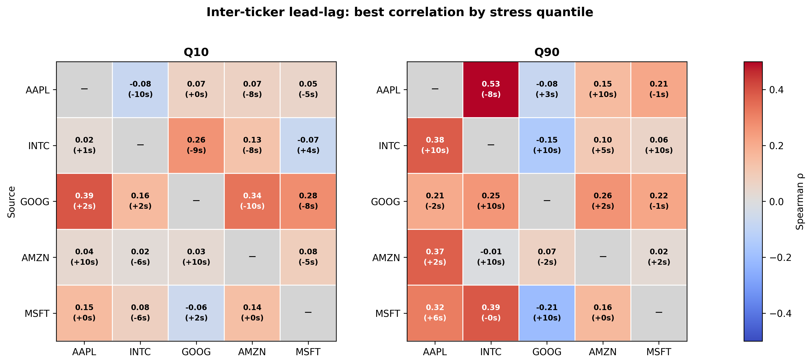
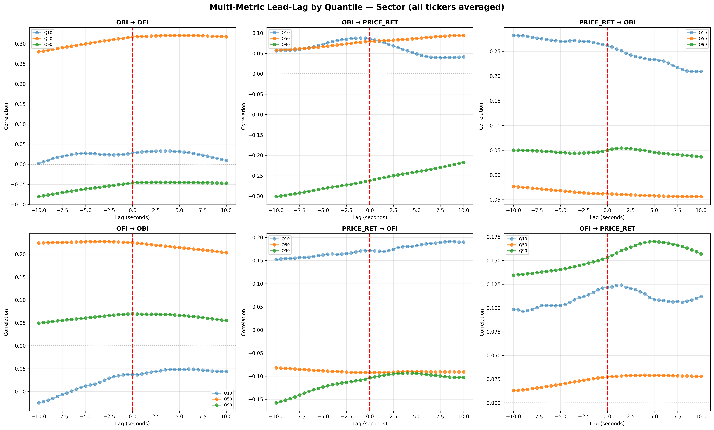

## Full Paper (PDF)

**[Open `paper/main.pdf`](paper/main.pdf)**

# Regime Detection and Contagion in High-Frequency Markets

Hierarchical Wasserstein-HMM pipeline on LOBSTER data (June 21, 2012) for five US tech names: AAPL, INTC, GOOG, AMZN, MSFT.

## Scope

- Data: 500 ms synchronized intraday limit-order-book features (~46,400 points per ticker).
- Features: price return, OBI, OFI.
- Regime labeling (Calm -> Intermediate -> Stressed):
  `sigma_tilde_r = norm99(|Delta p/p|) + norm99(|OBI|) + norm99(|OFI|)`
  with robust min-max scaling clipped to 1st-99th percentile.

## Method Overview

1. MAD normalization per ticker.
2. Temporal 1-Wasserstein distances on (price_ret, OBI, OFI).
3. Local HMMs + Meta-HMM (+ Direct Global HMM benchmark).
4. Transfer Entropy + quantile-conditioned lead-lag analysis.

Local HMM fitting uses 5 x 200 EM iterations (multi-restart), then best restart by log-likelihood.

## Results Snapshot (Aligned with `main.tex` Tables)

### 1) Local Regime Statistics by Ticker

<p align="center">
  <br>
  <br>
  <br>
  <br>
  <br>
</p>

Values below come from `paper/tables/regime_stats_*.tex`:

- AAPL: R2 Calm 9.4%, R0 Intermediate 56.0%, R1 Stressed 34.6%.
- INTC: R0 Calm 80.6%, R2 Intermediate 14.2%, R1 Stressed 5.2%.
- GOOG: R1 Calm 1.3%, R2 Intermediate 3.6%, R0 Stressed 95.1%.
- AMZN: R2 Calm 23.2%, R0 Intermediate 65.6%, R1 Stressed 11.2%.
- MSFT: R2 Calm 2.4%, R0 Intermediate 67.4%, R1 Stressed 30.2%.

### 2) Global Regime and Synchronization

<p align="center">
  <br>
  <br>
  <br>
</p>

From `paper/tables/local_global_sync.tex`:

- Total global transitions: 51.
- Sync rate: AAPL 0.0000 (0/51), GOOG 0.1373 (7/51), AMZN 0.0196 (1/51), MSFT 0.0196 (1/51), INTC 0.0000 (0/51).
- Leadership score: AAPL 1.0000, GOOG 1.0000, AMZN 1.0000, MSFT 0.1111, INTC 0.0000.

### 3) Inter-Ticker Lead-Lag Structure

<p align="center">
  <br>
  <br>
  <br>
  <br>
  <br>
</p>

The lead-lag map remains state-dependent (Q10/Q50/Q90) with stress amplification patterns visible in the multi-metric grid and channel decompositions.

### 4) Transfer Entropy (Top Directed Links)

From `paper/tables/transfer_entropy_top.tex`:

| Source -> Target | TE |
|---|---:|
| AMZN -> MSFT | 0.0035 |
| INTC -> MSFT | 0.0022 |
| AAPL -> MSFT | 0.0017 |
| GOOG -> MSFT | 0.0013 |
| MSFT -> INTC | 0.0013 |

MSFT is the dominant TE recipient in the current run outputs.

### 5) Robustness Diagnostics

From `paper/tables/robustness_unified.tex`:

- ARI meta vs K-means: 0.2123
- ARI direct vs K-means: 0.2587
- ARI meta vs direct: 0.3711
- Entropy mean: meta 0.0006, direct 0.0004
- State sync (meta vs direct): 0.7571

## Event Study

<p align="center">
  <br>
</p>

Representative GOOG OFI spike with synchronous cross-ticker response, consistent with fast cross-sectional reallocation.

## Quickstart

```bash
git clone https://github.com/AlexisNL/RIF_Quant.git
cd RIF_Quant
pip install -r requirements.txt

# optional parameter optimization
python scripts/optimize_hierarchical_parameters.py

# full pipeline
python scripts/run_hierarchical_contagion.py
```

## Notes

- Main manuscript: `paper/main.tex`
- Generated figures: `paper/figures/`
- Website/preview assets: `img/`

Working paper, February 2026.
