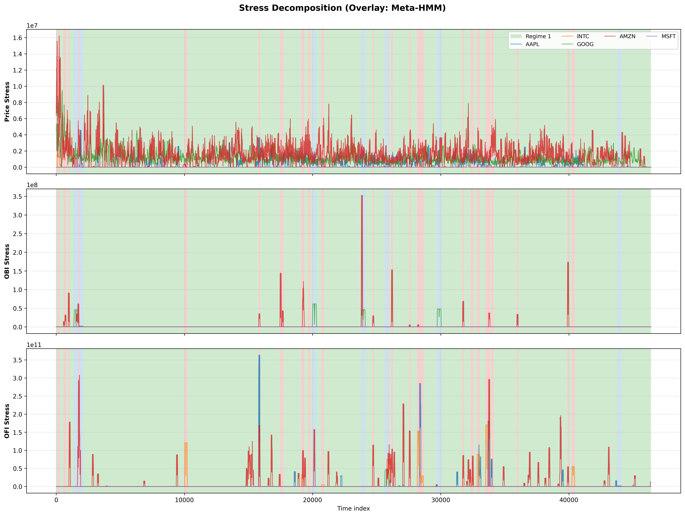

## Full Paper (PDF): **[Open `paper/main.pdf`](paper/main.pdf)**

# Regime Detection & Contagion in High-Frequency Markets
### A Hierarchical Wasserstein-HMM Framework

[](https://www.python.org/downloads/)
[](https://opensource.org/licenses/MIT)
[]()

> **Abstract:** This repository implements a novel framework to detect non-linear regime switches and stress propagation in Limit Order Books (LOB). By leveraging **Optimal Transport (Wasserstein Distance)** and **Hierarchical Hidden Markov Models**, I identify directed contagion pathways across the US Tech sector.

> **Data Context:** I apply this methodology to **LOBSTER high-frequency data from June 21, 2012** (AAPL, INTC, GOOG, AMZN, MSFT), synchronized on a sub-second grid.

---

## Core Methodology

Traditional correlation-based methods often fail to capture the distributional ruptures characteristic of HFT stress. My pipeline addresses this through:

1. **Robust Pre-processing:** Non-parametric **MAD normalization** to isolate standardized innovations from microstructure noise.
2. **Distributional Features:** Implementation of **Temporal 1-Wasserstein Distance** (before vs. after) to quantify shifts in the full LOB distribution (Micro-price, OBI, OFI).
3. **Hierarchical Modeling:**
   - **Local HMMs:** Individually optimized per ticker (AAPL, INTC, GOOG, AMZN, MSFT).
   - **Meta-HMM:** A consensus layer aggregating local state probabilities to identify sector-wide regimes.
4. **Causality & Contagion:** Measurement of directed information flow using **Transfer Entropy** and lead-lag quantile analysis to identify patient-zero events.

---

## Empirical Highlights (Sample Results)

- **Global Synchronization:** 72% agreement between Meta-HMM and Direct Global HMM architectures.
- **Contagion Pathways:** Identification of directed causal links (e.g., AAPL -> INTC) during liquidity shocks.
- **Robustness:** Validated via **Adjusted Rand Index (ARI)** against K-Means and **Maximum Mean Discrepancy (MMD)** diagnostics.

---

## Key Insights

### 1) Ticker-Level Regime Signatures

- **AAPL.** Regime 0 (56.9%, green/calm) is a low-stress baseline; Regime 1 (36.6%, blue/intermediate) is an intermediate state with broader increases across Price/OFI/OBI; Regime 2 (6.5%, red/stressed) concentrates the strongest joint Price-OFI-OBI ruptures, consistent with synchronized microstructure stress.
- **INTC.** Regime 0 (80.6%, green/calm) is dominant and comparatively calm; Regime 1 (13.3%, blue/intermediate) is imbalance-dominant (OBI peak); Regime 2 (6.1%, red/stressed) is flow-price dominant (OFI and Price peaks), indicating two distinct stress channels.
- **GOOG.** Regime 0 (95.1%, green/calm) reflects persistent baseline conditions; the rare Regime 1 (1.3%, red/stressed) is OFI-shock dominated; Regime 2 (3.6%, blue/intermediate) is OBI-surge dominated, separating flow toxicity from book-skew episodes.
- **AMZN.** Regime 0 (83.9%, green/calm) is the low-stress background; Regime 1 (4.7%, red/stressed) concentrates the strongest joint OFI-OBI stress; Regime 2 (11.4%, blue/intermediate) captures strong Price-OFI ruptures with more moderate imbalance.
- **MSFT.** Regime 0 (7.5%, red/stressed) concentrates the strongest Price-OBI disturbances; Regime 1 (29.3%, blue/intermediate) is OFI-led activity with limited price dislocation; Regime 2 (63.2%, green/calm) behaves as the baseline low Price/OFI state.

#### Posterior Probabilities by Ticker

These posterior plots provide a continuous view of regime confidence through the trading day (not only hard labels). The key takeaway is local heterogeneity: GOOG remains mostly in one dominant calm regime, while MSFT rotates more often across regimes, with AAPL/INTC/AMZN in between.

<p align="center">
  <br>
  <em>AAPL: Green = calm (R0), blue = intermediate (R1), red = stressed (R2).</em>
</p>

Interpretation: AAPL spends a large share of the session in calm/intermediate states, with stressed intervals concentrated in shorter bursts where Price, OFI, and OBI stress rise jointly.

<p align="center">
  <br>
  <em>INTC: Green = calm (R0), blue = intermediate (R1), red = stressed (R2).</em>
</p>

Interpretation: INTC shows two distinct stress channels: an imbalance-led intermediate regime and a flow-price stressed regime, supporting non-equivalent microstructure stress types.

<p align="center">
  <br>
  <em>GOOG: Green = calm (R0), red = stressed (R1), blue = intermediate (R2).</em>
</p>

Interpretation: GOOG is the most concentrated name (dominant calm state), with rare stress episodes that split between OFI-shock events and OBI-surge events.

<p align="center">
  <br>
  <em>AMZN: Green = calm (R0), red = stressed (R1), blue = intermediate (R2).</em>
</p>

Interpretation: AMZN is mostly calm, with stressed windows tied to joint OFI-OBI pressure and intermediate windows tied more to Price-OFI ruptures.

<p align="center">
  <br>
  <em>MSFT: Red = stressed (R0), blue = intermediate (R1), green = calm (R2).</em>
</p>

Interpretation: MSFT displays richer regime rotation than the other names, indicating more frequent switching between calm, intermediate, and stressed microstructure states.

### 2) Global Stress Validation with Meta-HMM

Figure below presents ticker-specific stress decomposition with Meta-HMM regime overlays, providing a visual validation of regime identification. Periods classified as high-stress regimes by the Meta-HMM correspond to visible elevations in temporal Wasserstein distances across multiple tickers simultaneously, particularly in the OFI dimension. The association between colored regime backgrounds and stress patterns supports that the Meta-HMM identifies economically meaningful periods of coordinated distributional change.

<p align="center">
  <br>
  <em>Ticker-specific stress decomposition with Meta-HMM regime overlays.</em>
</p>

Interpretation: when the global regime switches to stressed, stress spikes tend to appear simultaneously across multiple tickers and metrics, which validates that the global states track coordinated distributional moves rather than isolated single-name noise.

<p align="center">
  <br>
  <em>Meta-HMM global posterior regime probabilities throughout the trading day.</em>
</p>

Interpretation: global posterior transitions are sharp and confident, consistent with the hierarchical setup where local posteriors are first filtered and then aggregated at the sector level.

### 3) Lead-Lag Structure and Contagion Maps

<p align="center">
  <br>
  <em>Cross-correlations by stress quantile (Q10 = calm, Q50 = normal, Q90 = stress). Negative lags indicate source precedes target. Lead-lag structure intensifies in stressed periods.</em>
</p>

Interpretation: two robust patterns emerge. First, OFI shows strong short-horizon persistence (high autocorrelation). Second, cross-metric lead-lag effects strengthen in Q90 relative to Q10, showing that dependencies amplify in stress regimes.

<p align="center">
  <br>
  <em>Values represent the strongest Spearman correlation across quantiles for each ticker pair.</em>
</p>

Interpretation: inter-ticker dependence is selective rather than uniform. The strongest pairs involve INTC-MSFT and AAPL-AMZN, while some pairs remain near-zero, confirming heterogeneous contagion channels inside the same sector.

<p align="center">
  <br>
  <em>Each cell shows the best Spearman correlation between a ticker local Wasserstein stress and the global stress signal, with quantile fallback (Q90 -> Q50 -> Q10).</em>
</p>

Interpretation: local-to-global coupling is generally modest on this non-crisis day, which supports the paper's conclusion of partial, regime-dependent synchronization rather than permanent sector-wide lockstep behavior.

---

## Quickstart

### Installation
```bash
# Clone the repository
git clone https://github.com/AlexisNL/RIF_Quant.git
cd RIF_Quant

# Install dependencies
pip install -r requirements.txt
pip install numba  # Strongly recommended for Wasserstein speedup
```
